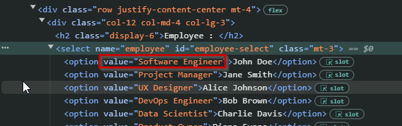

# The Bugs

### Select Box bugs

- On line 4, 'card-title' is a class, not an id.
- On line 10, in the for loop, we are creating 'li' elements. Should be 'options'.
- If you open the devtools and inspect the select element, you'll see that the value property is actually set to the employee title, rather than the name. The offending line is line 11!



### Three Wishes Form bugs
- On line 31, we should be using the ```querySelectorAll()``` method. This will return a collection of all the wish inputs, instead of just the first one, which we get with ```querySelector()```
- At the start of the form submission event handler, we need to call ```e.preventDefault()```, otherwise the usual behaviour will happen and the form will submit immediately
- In the wish input for loop, we need to convert all input to lowerCase(), not upperCase(), as our list of forbidden words is in lowercase.
- Ideally it would be better if the user could fill any 2 of the 3 fields and pass validation (edge case)
